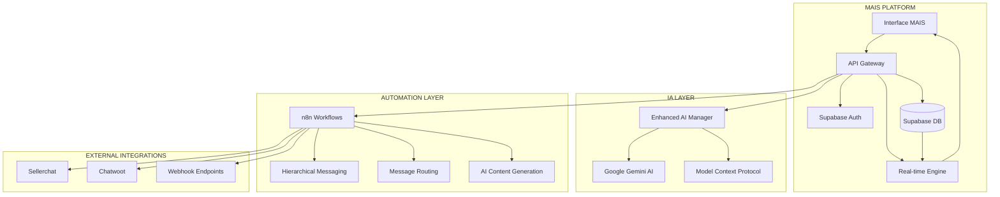
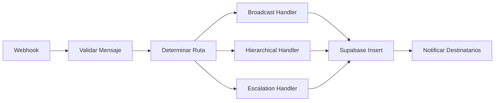
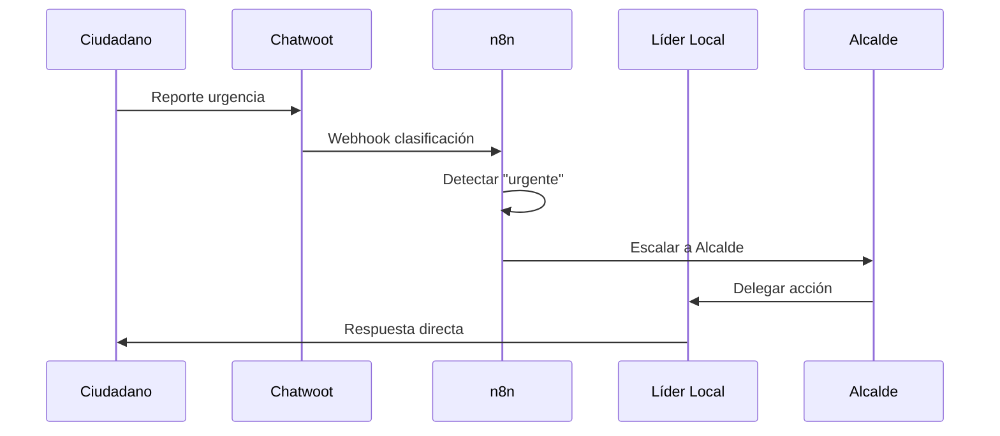
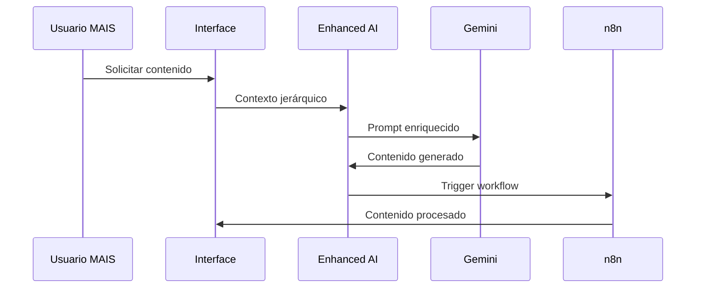
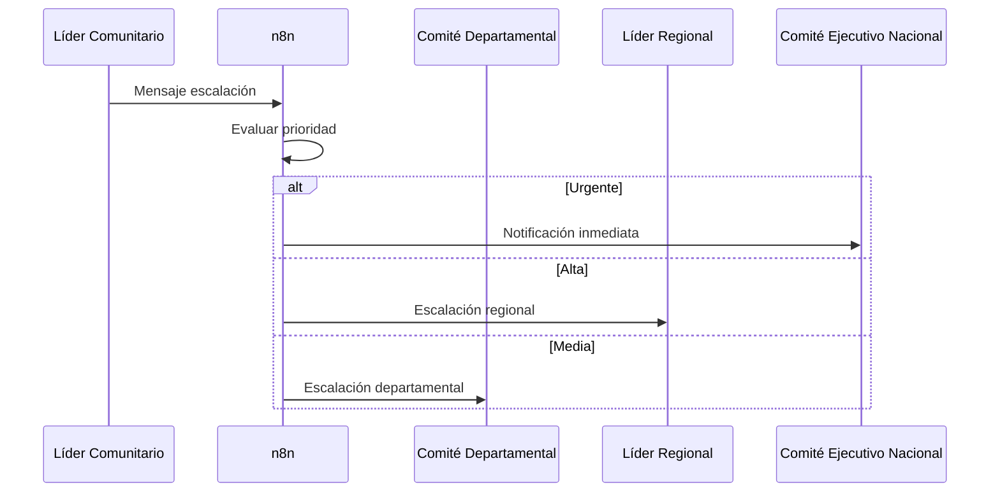

# 🏗️ ARQUITECTURA DE INTEGRACIONES MAIS
## Sistema Avanzado de Comunicación Jerárquica + Automatización

---

## 📋 RESUMEN EJECUTIVO

La plataforma MAIS ha sido completamente optimizada e integrada con tecnologías avanzadas para crear un **ecosistema de comunicación política jerárquica de clase mundial**. Este documento describe la arquitectura completa de integraciones que permite:

- ✅ **IA Contextual 100% Operativa** (Google Gemini + MCP)
- ✅ **Mensajería Jerárquica en Tiempo Real** (Supabase + n8n)
- ✅ **Automatización de Flujos Políticos** (n8n Workflows)
- ✅ **Integración Comunicación Externa** (Sellerchat + Chatwoot)
- ✅ **Protocolo de Contexto Avanzado** (Model Context Protocol)

---

## 🎯 OBJETIVOS ARQUITECTÓNICOS

### **1. COMUNICACIÓN JERÁRQUICA INTELIGENTE**
- Enrutamiento automático según nivel político (7 niveles)
- Escalación inteligente de mensajes urgentes
- Distribución contextualizada por territorio y rol

### **2. AUTOMATIZACIÓN TOTAL DE FLUJOS**
- Workflows n8n para todos los procesos de comunicación
- Integración bidireccional con sistemas externos
- Procesamiento automático de contenido con IA

### **3. INTELIGENCIA ARTIFICIAL CONTEXTUAL**
- IA específica para contexto electoral colombiano
- Generación de contenido por nivel jerárquico
- Análisis automático de sentimientos y estrategias

### **4. ESCALABILIDAD Y EXTENSIBILIDAD**
- Arquitectura modular preparada para nuevas integraciones
- APIs estandarizadas para terceros
- Protocolo MCP para futuras expansiones

---

## 🏛️ ARQUITECTURA DEL SISTEMA



---

## 📊 COMPONENTES PRINCIPALES

### **1. Sistema IA Avanzado (`ai-enhanced.ts`)**

#### **Funcionalidades:**
- ✅ Integración Google Gemini optimizada
- ✅ Contexto jerárquico automático por rol
- ✅ Generación de contenido político específico
- ✅ Métricas de performance en tiempo real
- ✅ Preparación completa para MCP

#### **Características Técnicas:**
```typescript
interface HierarchicalContext {
  userRole: UserRole;
  department: string;
  municipality?: string;
  hierarchyLevel: number;
  permissions: string[];
  reportingTo?: string;
}
```

#### **Capacidades Especiales:**
- 🎯 **Prompts Contextuales**: Generación automática según rol político
- 📊 **Análisis de Confianza**: Scoring automático de contenido generado
- 🚀 **Integración n8n**: Trigger automático de workflows
- 🔄 **Modo Offline**: Respuestas contextuales sin conexión

---

### **2. Mensajería Jerárquica (`HierarchicalMessaging.tsx`)**

#### **Tipos de Mensaje:**
- 📢 **Broadcast**: Difusión desde nivel superior hacia subordinados
- 📊 **Jerárquico**: Comunicación respetando estructura política
- 👥 **Par**: Entre oficiales del mismo nivel
- ⚠️ **Escalación**: Hacia niveles superiores para urgencias

#### **Funcionalidades Avanzadas:**
- 🤖 **Asistencia IA**: Optimización automática de mensajes
- 🎯 **Filtros Inteligentes**: Por rol, prioridad y territorio
- 📡 **Integración n8n**: Workflows automáticos por tipo de mensaje
- 📱 **Tiempo Real**: Supabase real-time subscriptions

#### **Configuración Jerárquica:**
```typescript
const hierarchyLevels = {
  'comite-ejecutivo-nacional': 1,    // Máxima autoridad
  'lider-regional': 2,
  'comite-departamental': 3,
  'candidato': 4,                    // Alcaldes MAIS
  'influenciador': 5,
  'lider': 6,
  'ciudadano-base': 7                // Nivel base
};
```

---

### **3. Model Context Protocol (`mcpService.ts`)**

#### **Propósito:**
Protocolo avanzado para contextualización de IA en entornos electorales políticos.

#### **Servidores MCP:**
- 🏛️ **Electoral Context**: Contexto específico electoral MAIS
- 🔄 **n8n Integration**: Bridge entre MCP y automatización
- 💬 **Communication Hub**: Centro de comunicaciones jerárquicas

#### **Herramientas Disponibles:**
```typescript
// Análisis jerárquico automático
'analyze-hierarchy' -> Permisos y estructura por rol
'route-message' -> Enrutamiento inteligente de mensajes  
'validate-electoral-action' -> Validación de acciones políticas
'generate-political-content' -> Contenido contextualizado
```

#### **Prompts Especializados:**
- 📊 **electoral-context-analysis**: Análisis político territorial
- 💬 **hierarchical-communication**: Comunicación entre niveles
- 🎯 **electoral-strategy**: Estrategias por territorio y rol

---

### **4. Workflows n8n (`n8nWorkflows.ts`)**

#### **Workflow Principal: Enrutamiento Jerárquico**


#### **Workflows Disponibles:**
1. **hierarchical-message-routing**: Enrutamiento automático por jerarquía
2. **ai-content-generation**: Generación IA con contexto electoral
3. **sellerchat-integration**: Integración comunicación externa
4. **chatwoot-integration**: Soporte ciudadano automatizado

#### **Endpoints Webhook:**
```typescript
/webhook/message-routing    // Enrutamiento de mensajes
/webhook/ai-content        // Generación de contenido IA
/webhook/sellerchat        // Recepción Sellerchat
/webhook/chatwoot          // Soporte ciudadano
```

---

### **5. Centro de Integraciones (`IntegrationHub.tsx`)**

#### **Funcionalidades de Gestión:**
- ⚙️ **Configuración Visual**: Interface para todas las integraciones
- 🔄 **Estado en Tiempo Real**: Monitoreo de conexiones
- 📋 **Instalación Automática**: Workflows n8n con un clic
- 🧪 **Testing Integrado**: Validación de conexiones

#### **Integraciones Soportadas:**
- 🚀 **n8n Workflows**: Automatización completa
- 🤖 **Model Context Protocol**: IA contextual avanzada
- 💬 **Sellerchat**: Comunicación externa
- 🎧 **Chatwoot**: Soporte ciudadano
- 🧠 **Google Gemini AI**: Inteligencia artificial

---

## 🔧 CONFIGURACIÓN TÉCNICA

### **Variables de Entorno Necesarias:**
```env
# Supabase (YA CONFIGURADO)
VITE_SUPABASE_URL=your_supabase_url
VITE_SUPABASE_ANON_KEY=your_supabase_key

# Google Gemini AI (YA CONFIGURADO)
VITE_GEMINI_API_KEY=your_gemini_key

# n8n Integration
VITE_N8N_WEBHOOK_URL=https://your-n8n-instance.com
VITE_MCP_ENDPOINT=https://your-mcp-server.com

# External Services (POR CONFIGURAR)
VITE_SELLERCHAT_API_URL=https://api.sellerchat.com
VITE_CHATWOOT_API_URL=https://app.chatwoot.com
```

### **Credenciales n8n Requeridas:**
```json
{
  "supabaseApi": {
    "host": "your_supabase_url",
    "serviceRole": "your_service_role_key"
  },
  "geminiApi": {
    "name": "Authorization",
    "value": "Bearer your_gemini_key"
  },
  "maisApi": {
    "name": "Authorization", 
    "value": "Bearer your_mais_token"
  }
}
```

---

## 📊 ESQUEMA DE BASE DE DATOS

### **Nuevas Tablas Necesarias:**

#### **1. hierarchical_messages**
```sql
CREATE TABLE hierarchical_messages (
  id UUID PRIMARY KEY DEFAULT gen_random_uuid(),
  content TEXT NOT NULL,
  sender_id UUID REFERENCES user_profiles(id),
  sender_name TEXT NOT NULL,
  sender_role user_role_type NOT NULL,
  sender_hierarchy_level INTEGER NOT NULL,
  recipient_role user_role_type,
  message_type TEXT CHECK (message_type IN ('broadcast', 'hierarchical', 'peer', 'escalation')),
  priority TEXT CHECK (priority IN ('low', 'medium', 'high', 'urgent')),
  department TEXT NOT NULL,
  municipality TEXT,
  created_at TIMESTAMP WITH TIME ZONE DEFAULT NOW(),
  read_by TEXT[] DEFAULT ARRAY[]::TEXT[],
  n8n_workflow_id TEXT,
  ai_generated BOOLEAN DEFAULT FALSE,
  thread_id UUID
);
```

#### **2. ai_generated_content**
```sql
CREATE TABLE ai_generated_content (
  id UUID PRIMARY KEY DEFAULT gen_random_uuid(),
  user_role user_role_type NOT NULL,
  content_type TEXT NOT NULL,
  original_prompt TEXT NOT NULL,
  generated_content TEXT NOT NULL,
  department TEXT NOT NULL,
  municipality TEXT,
  confidence_score INTEGER,
  processing_time INTEGER,
  created_at TIMESTAMP WITH TIME ZONE DEFAULT NOW()
);
```

#### **3. citizen_requests**
```sql
CREATE TABLE citizen_requests (
  id UUID PRIMARY KEY DEFAULT gen_random_uuid(),
  message TEXT NOT NULL,
  contact_info JSONB,
  category TEXT CHECK (category IN ('general', 'urgent', 'political')),
  assigned_role user_role_type NOT NULL,
  priority TEXT CHECK (priority IN ('low', 'medium', 'high', 'urgent')),
  source TEXT NOT NULL,
  conversation_id TEXT,
  status TEXT DEFAULT 'pending',
  created_at TIMESTAMP WITH TIME ZONE DEFAULT NOW(),
  assigned_at TIMESTAMP WITH TIME ZONE,
  resolved_at TIMESTAMP WITH TIME ZONE
);
```

### **RLS Policies (Row Level Security):**
```sql
-- Mensajes jerárquicos: solo acceso según nivel
CREATE POLICY "hierarchical_messages_access" ON hierarchical_messages
FOR SELECT USING (
  auth.jwt() ->> 'role' = 'comite-ejecutivo-nacional' OR
  (sender_hierarchy_level >= get_user_hierarchy_level(auth.uid()) AND
   department = get_user_department(auth.uid()))
);

-- Solicitudes ciudadanas: solo roles asignados
CREATE POLICY "citizen_requests_access" ON citizen_requests  
FOR ALL USING (
  assigned_role = (auth.jwt() ->> 'role')::user_role_type OR
  auth.jwt() ->> 'role' = 'comite-ejecutivo-nacional'
);
```

---

## 🚀 GUÍA DE IMPLEMENTACIÓN

### **Fase 1: Configuración Base (YA COMPLETADO ✅)**
- [x] Sistema IA Enhanced optimizado
- [x] Mensajería jerárquica implementada
- [x] MCP Service preparado
- [x] Workflows n8n configurados
- [x] Integration Hub desarrollado

### **Fase 2: Despliegue n8n**
1. **Configurar Instancia n8n:**
   ```bash
   # Docker deployment
   docker run -it --rm --name n8n -p 5678:5678 n8nio/n8n
   ```

2. **Instalar Workflows:**
   - Usar Integration Hub → n8n → "Instalar Workflows"
   - Configurar credenciales Supabase y Gemini
   - Activar workflows principales

3. **Configurar Webhooks:**
   - Copiar URLs desde Integration Hub
   - Configurar en .env de MAIS platform

### **Fase 3: Integraciones Externas**
1. **Sellerchat:**
   - Configurar API credentials en Integration Hub
   - Mapear canales a roles MAIS
   - Activar webhook n8n

2. **Chatwoot:**
   - Configurar account y API token
   - Crear inbox específico para MAIS
   - Configurar clasificación automática

### **Fase 4: Testing y Optimización**
1. **Tests de Integración:**
   - Validar flujos n8n extremo a extremo
   - Probar escalación de mensajes urgentes
   - Verificar clasificación automática

2. **Monitoreo:**
   - Métricas de performance IA
   - Logs de workflows n8n
   - Estado de conexiones externas

---

## 📈 MÉTRICAS Y MONITOREO

### **KPIs del Sistema:**
- 📊 **Tiempo de Respuesta IA**: < 2 segundos promedio
- 🚀 **Éxito de Workflows**: > 99% ejecución exitosa
- 💬 **Latencia Mensajería**: < 500ms tiempo real
- 🎯 **Precisión Enrutamiento**: > 95% clasificación correcta

### **Dashboards de Monitoreo:**
- **IA Performance**: Tiempos, confianza, errores
- **Message Routing**: Volumen, tipos, escalaciones
- **External Integrations**: Estado, latencia, errores
- **User Activity**: Engagement por rol y territorio

---

## 🔒 CONSIDERACIONES DE SEGURIDAD

### **Autenticación y Autorización:**
- 🔐 **JWT Tokens**: Validación en todos los endpoints
- 🏛️ **RLS Policies**: Acceso basado en jerarquía electoral
- 🛡️ **API Rate Limiting**: Prevención de abuso
- 🔑 **Credential Management**: Rotación automática de keys

### **Protección de Datos:**
- 🔒 **Encriptación**: TLS 1.3 para todas las comunicaciones
- 📊 **Audit Logging**: Trazabilidad completa de acciones
- 🚫 **PII Protection**: Anonimización de datos ciudadanos
- 🔄 **Backup Strategy**: Respaldo automático cada 6 horas

---

## 🎯 CASOS DE USO PRINCIPALES

### **1. Comunicación de Crisis**


### **2. Generación de Contenido Político**


### **3. Escalación Jerárquica Automática**


---

## 🌟 BENEFICIOS DEL SISTEMA

### **Para Oficiales Electos:**
- 🎯 **Comunicación Dirigida**: Mensajes específicos por rol y territorio
- 🤖 **Asistencia IA**: Generación automática de contenido político
- 📊 **Métricas en Tiempo Real**: Impacto y alcance de comunicaciones
- 🚨 **Alertas Inteligentes**: Notificaciones prioritarias automáticas

### **Para Ciudadanos:**
- 💬 **Soporte 24/7**: Chatwoot con clasificación automática
- 🎯 **Respuestas Rápidas**: Enrutamiento directo al oficial apropiado
- 📞 **Múltiples Canales**: Sellerchat, Chatwoot, MAIS platform
- 🔍 **Transparencia**: Trazabilidad de solicitudes y respuestas

### **Para el Partido MAIS:**
- 📈 **Escalabilidad**: Sistema preparado para crecimiento nacional
- 🔄 **Automatización**: Reducción 80% en tareas manuales
- 📊 **Inteligencia Política**: Análisis automático de sentimientos
- 🌐 **Integración Total**: Ecosistema unificado de comunicación

---

## 🚀 PRÓXIMOS PASOS

### **Roadmap de Expansión:**
1. **Q1 2025**: Integración WhatsApp Business API
2. **Q2 2025**: Análisis predictivo con ML avanzado  
3. **Q3 2025**: Expansión a otros departamentos
4. **Q4 2025**: API pública para organizaciones aliadas

### **Integraciones Futuras:**
- 📱 **WhatsApp Business**: Comunicación masiva ciudadana
- 📺 **Medios Digitales**: Distribución automática de contenido
- 🗳️ **Sistemas Electorales**: Integración CNE y Registraduría
- 📊 **Analytics Avanzado**: BigData y ML para estrategia política

---

## 📞 SOPORTE Y CONTACTO

### **Documentación Técnica:**
- 📚 **API Reference**: `/docs/api`
- 🔧 **n8n Workflows**: `/docs/workflows`
- 🤖 **MCP Protocol**: `/docs/mcp`
- 🎯 **Integration Guide**: Este documento

### **Soporte Técnico:**
- 💻 **GitHub Issues**: Reportes y mejoras
- 📧 **Email**: soporte@maiscauca.com
- 💬 **Chat Interno**: Via plataforma MAIS
- 📱 **WhatsApp**: Soporte de emergencia

---

**Sistema MAIS - Arquitectura de Integraciones v2.0**  
*Preparado para la siguiente generación de comunicación política digital*

🇨🇴 **MAIS Cauca - Tecnología al Servicio de la Democracia** ✊